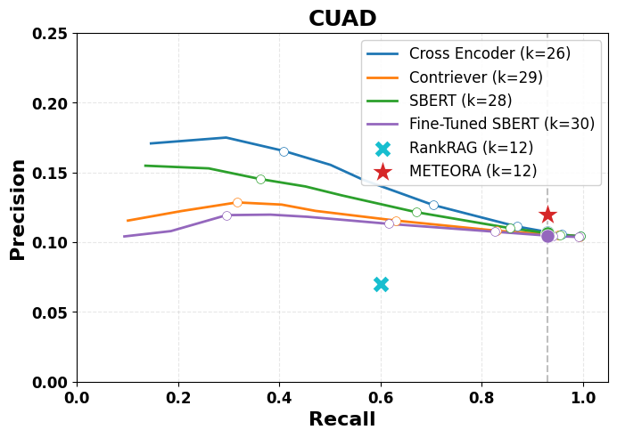

# METEORA: Method for Interpretable Rank-Free Evidence Selection with Optimal Rationale

This repository contains the official implementation of **METEORA**, a rationale-driven chunk selection framework that replaces re-ranking in Retrieval-Augmented Generation (RAG) with a transparent, robust, and explanation-based approach. METEORA is designed for high-stakes domains such as law, finance, and scientific research, where factual precision and adversarial robustness are critical.

📄 **Paper**: _Under review in NeurIPS 2025_  
🧠 **Authors**: Anonymous et.al.

---

## 🚀 Highlights

- **Top-k Free Selection**: No heuristic tuning required. Selection is adaptive and interpretable.
- **Query-Aligned Rationales**: Generated using Direct Preference Optimization (DPO).
- **Unsupervised Evidence Selector (ECSE)**: Combines rationale pairing, semantic pooling, and context expansion.
- **Verifier LLM**: Filters adversarial or poisoned chunks using rationale-derived instructions.
- **Explainable Pipeline**: Every selected chunk is justified and traceable end-to-end.
- **Adversarial Resilience**: 3.4 times improvement in F1 score over SoTA perplexity-based defenses.

---

## 📊 Key Results

| Task                  | Metric      | RankRAG | METEORA |
|-----------------------|-------------|---------|---------|
| Chunk Prioritization  | Precision   | 0.13    | **0.19** (+46%) |
|                       | Recall      | 0.68    | **0.93** (+37%) |
| Generation Accuracy   | Accuracy    | 54.3%   | **72.8%** (+34%) |
| Adversarial Detection | F1 Score    | 0.10    | **0.44** (3.4x) |

---

## 🧩 Components

### 1. Rationale Generator
- Trained using DPO
- Generates rationales aligned to query-context pairs
- Preference dataset created automatically from QA data

### 2. ECSE: Evidence Chunk Selection Engine
- **Pairing**: Matches rationales to best-fitting chunks
- **Pooling**: Uses elbow detection on pooled rationale embedding
- **Expansion**: Includes nearby context windows

### 3. Verifier LLM
- Uses rationale-derived instructions to flag contradictions, factual errors, or instruction violations
- Boosts resilience to corpus poisoning

---

## 📂 Directory Overview

```                
├── Experiments/
│   ├── Ablation/
│   ├── Adversarial/
│   ├── CP Task/
│   └── Generation/
├── Images/               
├── requirements.txt
└── README.md
```

---

## ⚙️ Getting Started

### 1. Installation

```bash
git clone https://github.com/<your-username>/meteora.git
cd meteora
pip install -r requirements.txt
```

### 2. Run Experiments

```bash
# Train Rationale Generator
python train_dpo.py --config configs/dpo_config.json

# Run ECSE selection
python run_selector.py --dataset contractnli

# Evaluate generation task
python evaluate_generation.py --dataset privacyqa
```

---

## 📚 Datasets

| Domain     | Dataset        | Description |
|------------|----------------|-------------|
| Legal      | ContractNLI    | Entailment classification with clause evidence |
| Legal      | PrivacyQA      | QA from real privacy policies |
| Legal      | CUAD           | Clause extraction from commercial contracts |
| Legal      | MAUD           | QA over merger agreements |
| Finance    | FinQA          | Financial document QA |
| Academic   | QASPER         | Scientific paper QA |

---

## 📈 Visual Example

<p align="center">
  
  <br>
  <em>METEORA improves answer accuracy while using ~50% fewer chunks than baseline RAG methods.</em>
</p>

---

## 📜 Citation

```bibtex
@inprogress{meteora2025,
  title     = {METEORA: Method for Interpretable Rank-Free Evidence Selection with Optimal Rationale},
  author    = {},
  journal   = {NeurIPS},
  year      = {2025},
  note      = {Under Review}
}
```

---

